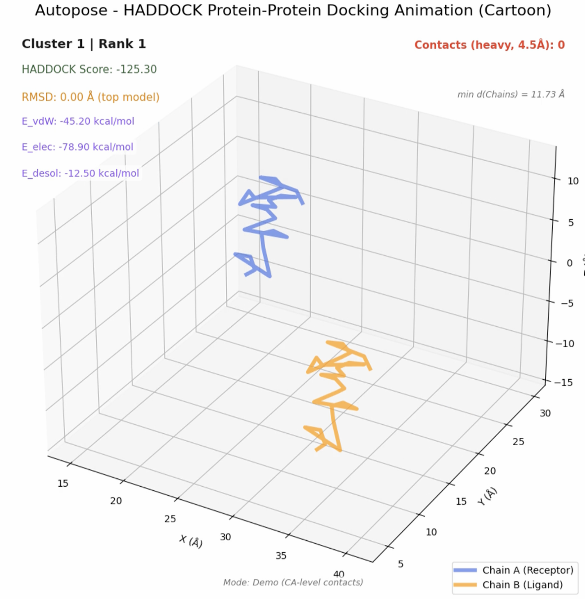

# Autopose - Protein Docking Animation Generator

A comprehensive web-based tool for generating MP4 video animations of protein-ligand and protein-protein docking results from AutoDock4, AutoDock Vina, ClusPro, and HADDOCK outputs.



## 🚀 Features

- **AutoDock4**: Parse DLG files, extract binding energies, generate animations with overlays
- **AutoDock Vina**: Multi-pose animation with separate/overlay modes and score overlays
- **ClusPro**: Protein-protein docking animations with interface analysis and energy breakdown
- **HADDOCK 2.4**: Protein-protein docking with HADDOCK scores, RMSD, and energy components
- **Visualization Styles**: Sticks, ribbon, lines, spheres, surface, cartoon
- **Professional Output**: 1080p MP4 videos with comprehensive overlay information

## 🛠️ Installation

```bash
git clone https://github.com/QiaoJiang08/Autopose.git
cd Autopose
python3 -m venv .venv
source .venv/bin/activate
pip install -r requirements.txt
brew install ffmpeg  # macOS
```

## 🚀 Quick Start

```bash
python3 app.py
# Open http://localhost:5002
```

1. Choose docking engine (AutoDock4, Vina, ClusPro, or HADDOCK)
2. Upload required files
3. Select visualization style
4. Generate and download MP4 animation

### Required Files by Engine

| Engine | Files Required |
|--------|---------------|
| AutoDock4 | Protein PDB + DLG file |
| Vina | Receptor PDB + Ligand PDBQT + Output PDBQT + Log TXT |
| ClusPro | Monomer PDB + Model PDB(s) + Scores CSV |
| HADDOCK | Monomer PDB + Model PDB(s) + cluster_ener.txt + cluster_rmsd.txt |

## 📁 Project Structure

- `app.py` - Main Flask application
- `docking_animator_enhanced.py` - Core animation engine for AutoDock4/Vina
- `cluspro_adapter.py` - ClusPro data parser
- `cluspro_animator.py` - ClusPro animation generator
- `haddock_adapter.py` - HADDOCK data parser
- `haddock_animator.py` - HADDOCK animation generator
- `templates/index.html` - Web interface
- Sample files for testing all engines

## 🧪 Testing

```bash
python3 test_cluspro.py  # Test ClusPro functionality
python3 test_haddock.py  # Test HADDOCK functionality
```

## 📊 Sample Data

Includes sample files for AutoDock4, Vina, ClusPro, and HADDOCK testing.

## 🎯 Use Cases

- Research presentations and publications
- Educational molecular visualization
- Drug discovery analysis
- Professional scientific communication

## 🤝 Contributing

1. Fork the repository
2. Create feature branch
3. Commit changes
4. Open Pull Request

## 📝 License

MIT License

## 🎉 What's New

**Version 2.1**: Added HADDOCK 2.4 protein-protein docking support with comprehensive energy analysis and RMSD overlays.

**Version 2.0**: Added ClusPro protein-protein docking support with interface analysis and multiple model animation.

---

**Ready to create stunning molecular animations with Autopose?** Get started with the sample files! ⭐

---

**Ready to create stunning molecular animations?** Get started with the sample files! ⭐ 